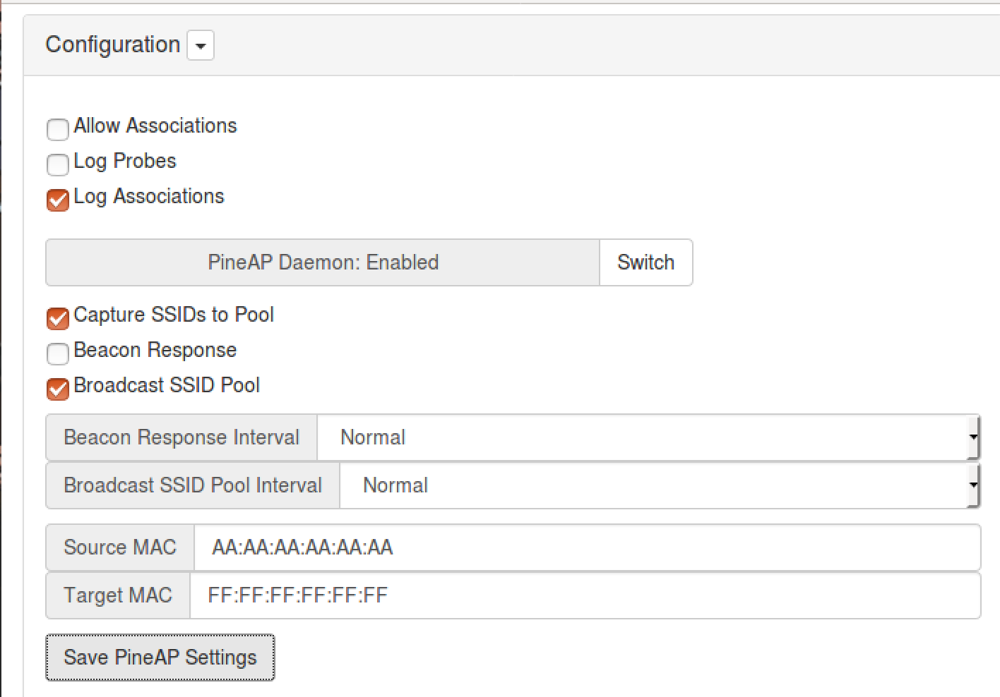
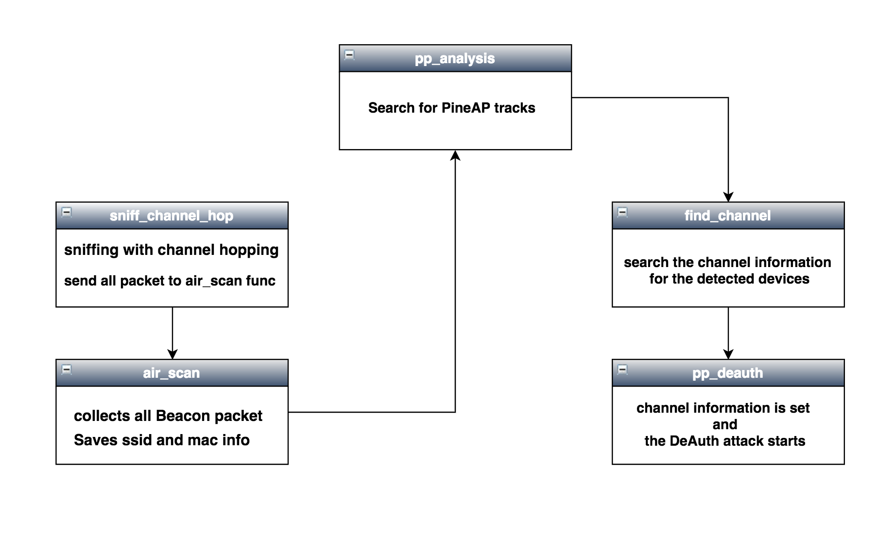
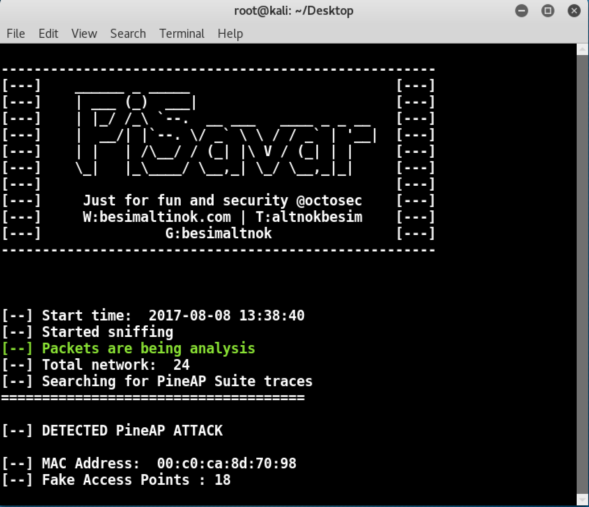
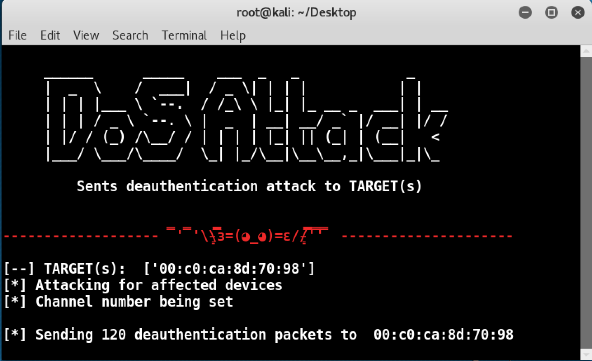

# PiSavar  - [ - PineAP Suite - Analysis, Detect, Kill - ]

<p align="center">

</p>

<p align="center">
</a> 
</p>


### How to work PineAP Suite

* Collect SSID information
* Creates SSID pool with collected SSID information
* Creates fake access points using information in the SSID pool

</img>

### Where is the problem?

-  `One MAC address, more than one SSID information .... ..- -. - . .-. `


### Features of PiSavar

* Detects PineAP Suite 
* Detects networks opened by PineAP Suite.
* List of clients connected to fake access points
* Starts deauthentication attack for PineAP Suite.

#### Diagram

</img>

### --------------------------------------------------------------------------------

### Usage
Run the program with following command: 

```python
airmon-ng start wlan0
python pisavar.py wlan0mon

```


### Screenshots
</img>
</img>


### Demo Video

### Authors
This project is written by Besim ALTINOK
